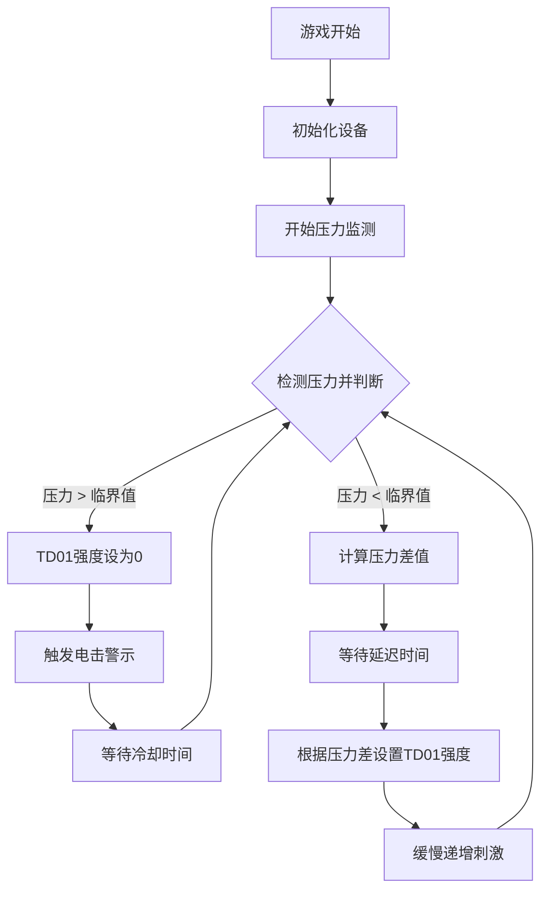

# 寸止玩法游戏

一个基于气压传感器的寸止训练游戏，通过检测括约肌压力变化，结合偏轴电机控制器和电击设备进行智能刺激控制。

## 游戏概述

### 游戏目标
- 通过气压传感器监测括约肌压力
- 根据压力变化智能调节刺激强度
- 实现寸止训练效果

### 游戏机制
1. **压力监测**：气压传感器实时检测括约肌压力变化
2. **智能调节**：压力高时降低刺激，压力低时增强刺激
3. **电击警示**：压力超过临界值时触发电击使用户清醒
4. **延迟启动**：压力低时延迟一段时间后才开始缓慢刺激
5. **动态平衡**：维持在临界压力附近的平衡状态

## 设备要求

### 设备配置

| 设备类型 | 逻辑ID | 设备名称 | 是否必需 | 作用 |
|---------|--------|----------|----------|------|
| QIYA | pressure_sensor | 气压传感器 | 是 | 检测括约肌压力变化 |
| TD01 | motor_controller | 偏轴电机控制器 | 是 | 提供可调节强度的刺激 |
| DIANJI | shock_device | 电击设备 | 否 | 压力过高时的警示电击 |
| ZIDONGSUO | auto_lock | 自动锁设备 | 否 | 游戏开始时锁定，结束时解锁 |

## 游戏参数配置

### 基础参数

| 参数名 | 类型 | 范围 | 默认值 | 说明 |
|--------|------|------|--------|------|
| duration | 数字 | 1-120分钟 | 20分钟 | 游戏持续时间 |
| criticalPressure | 数字 | 0-40kPa | 20kPa | 临界气压值 |
| maxMotorIntensity | 数字 | 1-255 | 200 | TD01最大强度 |

### 刺激控制参数

| 参数名 | 类型 | 范围 | 默认值 | 说明 |
|--------|------|------|--------|------|
| lowPressureDelay | 数字 | 1-30秒 | 5秒 | 压力低时延迟刺激时间 |
| stimulationRampRateLimit | 数字 | 1-50 | 10 | 刺激强度递增速率限制（每s变化不超过此值） |
| pressureSensitivity | 数字 | 0.1-5.0 | 1.0 | 压力变化敏感度系数 |
| stimulationRampRandomPercent | 数字 | 0-100% | 0% | 刺激强度随机扰动百分比 |

### 电击参数

| 参数名 | 类型 | 范围 | 默认值 | 说明 |
|--------|------|------|--------|------|
| shockIntensity | 数字 | 10-100V | 20V | 电击强度 |
| shockDuration | 数字 | 0.5-5秒 | 1秒 | 电击持续时间 |

## 状态转移图



## 算法逻辑

### 压力-强度映射算法
```
if (currentPressure >= criticalPressure) {
    motorIntensity = 0
    triggerShock()
} else if (currentPressure < criticalPressure) {
    pressureDiff = criticalPressure - currentPressure
    targetIntensity = (pressureDiff / criticalPressure) * maxMotorIntensity
    
    // 延迟启动机制，刺激强度渐变，刺激强度随机扰动
}
```

### 安全机制
- 电击设备具有最大触发频率限制
- TD01强度变化采用渐变模式，避免突然变化

## 游戏界面说明

### 主界面元素
- **当前压力**：实时显示气压传感器读数
- **临界压力线**：显示设定的临界压力值
- **TD01强度**：当前电机控制器输出强度
- **剩余时间**：游戏剩余时间
- **压力曲线图**：实时压力变化趋势
- **设备状态**：各设备连接和工作状态

### 状态指示
- 🟢 压力正常：绿色指示灯
- 🟡 压力偏低：黄色指示灯  
- 🔴 压力过高：红色指示灯
- ⚡ 电击触发：闪烁红色警示

## 开发信息

### 版本历史
- v1.0.0：基础功能实现

### 技术特点
- 实时压力监测和响应
- 智能刺激强度调节算法
- 多重安全保护机制
- 直观的可视化界面